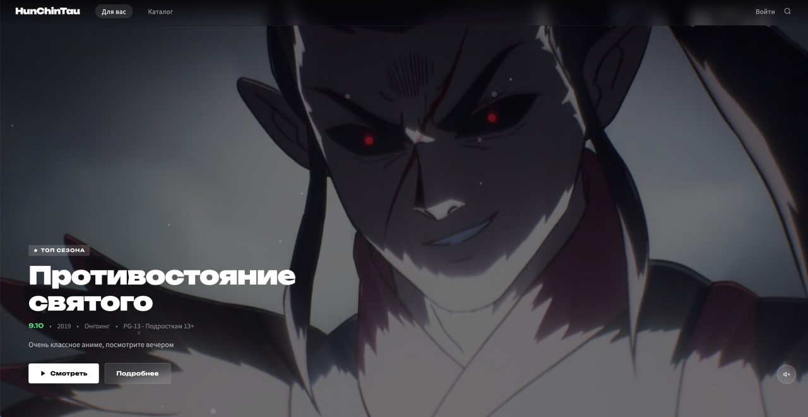

# HunChinTau

HunChinTau — платформа для просмотра аниме с современным интерфейсом и системой закладок



## Особенности

- 🎬 **Каталог аниме** с фильтрами по жанрам, статусу, году, озвучке и рейтингу
- 🔖 **Закладки** с возможностью отслеживания статуса просмотра
- 🎥 **Встроенный видеоплеер** с поддержкой перемотки и горячих клавиш
- 🔍 **Поиск аниме** с автодополнением
- 👤 **Профиль пользователя** с закладками
- 🎨 **Минималистичный дизайн** без лишних элементов

## Технологии

- **Backend:** Django 6.x, Python 3.13+
- **Frontend:** HTML5, CSS3, JavaScript (Vanilla)
- **Видеоплеер:** Plyr
- **3D эффекты:** Three.js
- **База данных:** SQLite (по умолчанию), PostgreSQL (рекомендуется для production)

## Требования

- Python 3.13 или выше
- pip (менеджер пакетов Python)
- FFmpeg (для обработки видео, опционально)

## Установка

### 1. Клонирование репозитория

```bash
git clone <repository-url>
cd hun_chin_tau
```

### 2. Создание виртуального окружения

```bash
# macOS/Linux
python3 -m venv .venv
source .venv/bin/activate

# Windows
python -m venv .venv
.venv\Scripts\activate
```

### 3. Установка зависимостей

```bash
pip install -r requirements.txt
```

### 4. Применение миграций

```bash
python manage.py migrate
```

### 5. Создание суперпользователя

```bash
python manage.py createsuperuser
```

### 6. Запуск сервера разработки

```bash
python manage.py runserver
```

Откройте браузер и перейдите по адресу: **http://127.0.0.1:8000/**

## Настройка

### Переменные окружения (опционально)

Создайте файл `.env` в корне проекта:

```env
SECRET_KEY=your-secret-key-here
```

## Добавление аниме

1. Войдите в админ-панель: **http://127.0.0.1:8000/admin/**
2. Добавьте жанры, теги и озвучки
3. Создайте аниме:
   - Заполните названия (русское, английское, оригинальное)
   - Добавьте описание и постер
   - Выберите жанры и теги
   - Укажите статус, год, рейтинг
4. **Добавьте сезоны** (внизу страницы аниме):
   - Нажмите "Добавить сезон"
   - Укажите номер сезона и название (если есть)
   - Сохраните
5. **Добавьте эпизоды** (внутри сезона):
   - Выберите сезон
   - Добавьте эпизоды с номерами и названиями
   - Для каждого эпизода укажите источник видео:
     - **Прямое видео** — загрузите файл или укажите URL
     - **Iframe** — вставьте ссылку на внешний плеер (Anitype, Kodik)
6. Добавьте озвучку (опционально)

### Структура данных

```
Аниме
├── Сезон 1
│   ├── Эпизод 1 (с видео)
│   ├── Эпизод 2 (с видео)
│   └── ...
├── Сезон 2
│   ├── Эпизод 1 (с видео)
│   └── ...
└── ...
```

## Структура проекта

```
hun_chin_tau/
├── anime/              # Приложение: каталог аниме, главная страница
├── episodes/           # Приложение: эпизоды, сезоны, озвучки
├── player/             # Приложение: видеоплеер
├── users/              # Приложение: пользователи, профиль, закладки
├── hun_chin_tau/       # Настройки проекта Django
├── media/              # Медиа файлы (постеры, видео)
├── static/             # Статические файлы (CSS, JS, изображения)
├── manage.py           # Скрипт управления Django
└── requirements.txt    # Зависимости проекта
```

## Приложения

### anime
- Главная страница с Hero-секцией
- Страница аниме с описанием и эпизодами
- Поиск аниме

### episodes
- Модели: Episode, Season, VoiceActor, PlayerSource
- Управление эпизодами и сезонами
- Источники видео (прямые файлы, iframe)
- **Разделение эпизодов по сезонам**

### player
- Видеоплеер на базе Plyr
- Перемотка, горячие клавиши
- Навигация между эпизодами

### users
- Регистрация, вход, выход
- Профиль пользователя
- Закладки с статусами (Смотрю, Просмотрено, В планах, Отложено, Брошено)

## Горячие клавиши (в плеере)

| Клавиша | Действие |
|---------|----------|
| `Пробел` | Пауза/Воспроизведение |
| `←` | Перемотка назад на 10 сек |
| `→` | Перемотка вперёд на 10 сек |
| `0-9` | Перемотка на 0%-90% видео |


## Поддержка

Для вопросов и предложений пишите в тг @marselnet
